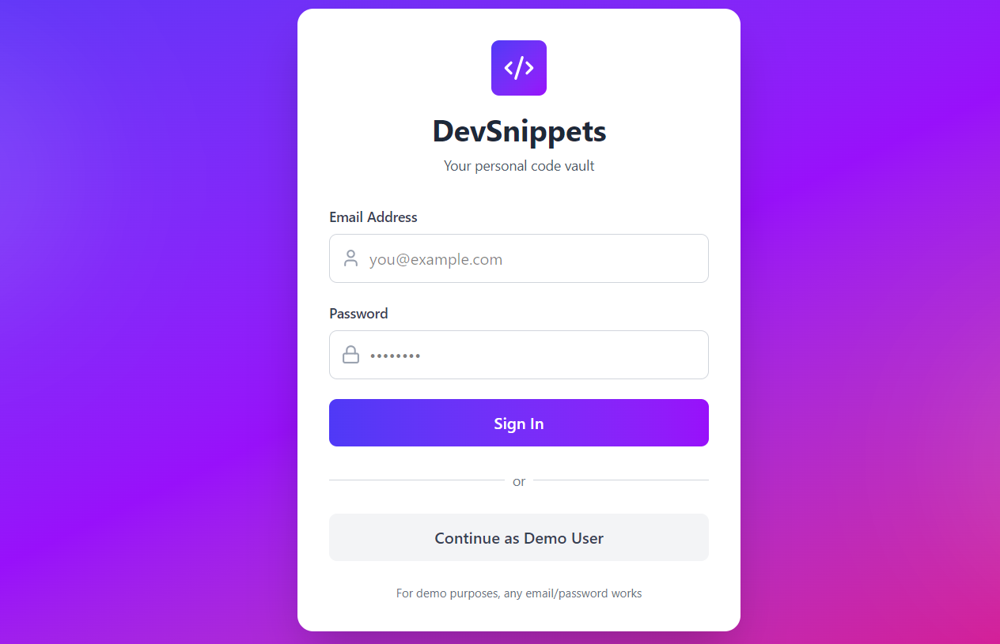
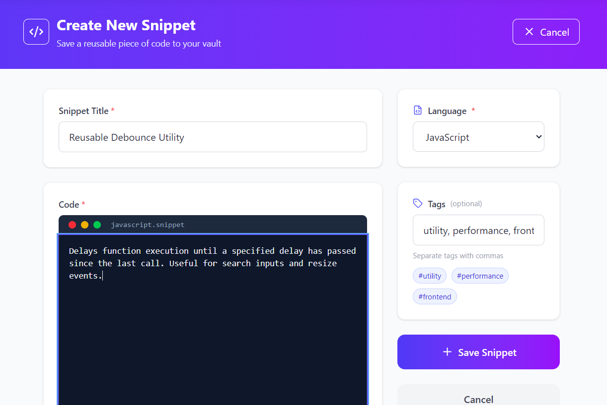
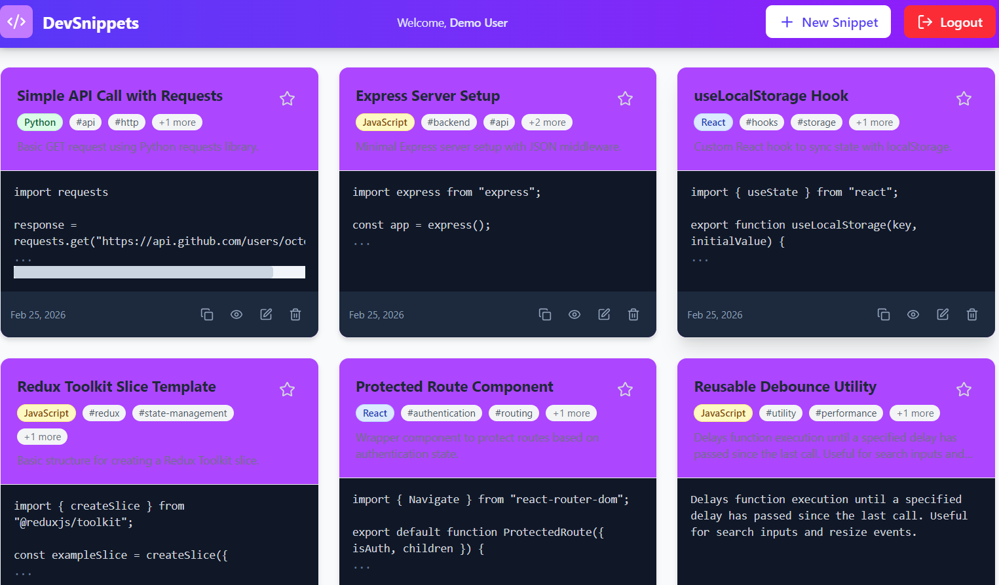

# DevSnippets Manager

A clean and lightweight **Developer Snippet Manager** built with **React, Redux Toolkit, Tailwind CSS, and React Router**.
Store, organize, search, and quickly access reusable code snippets — all in a fast, distraction-free interface.

---

## 🚀 Overview

DevSnippets is a personal productivity tool for developers to save frequently used code, categorize it by language, add tags, and retrieve it instantly.
All data is stored locally, making it fast, private, and easy to use without any backend.

---

## ✨ Features

* 🔐 Fake authentication with protected routes
* ➕ Create, edit, and delete snippets
* 🔍 Search snippets by title or tags
* 🏷 Filter by programming language
* ⭐ Mark snippets as favorites
* 📋 One-click copy to clipboard
* 🗂 Tag-based organization
* 💾 Data persistence using localStorage
* 📱 Responsive UI with Tailwind CSS
* 🎨 Clean developer-friendly interface

---

## 🧠 How It Works

### State Management

* **Redux Toolkit** manages:

  * Authentication state
  * Snippet data
  * Filters and search
* Global state allows access across multiple routes without prop drilling.

### Routing

Implemented using **React Router**:

| Route          | Description             |
| -------------- | ----------------------- |
| `/login`       | User login (simulation) |
| `/dashboard`   | View all snippets       |
| `/create`      | Add a new snippet       |
| `/edit/:id`    | Edit existing snippet   |
| `/snippet/:id` | View snippet details    |

Protected routes redirect unauthenticated users to login.

### Data Storage

All snippets are saved in **localStorage**:

* No backend required
* Data persists after refresh
* Fully client-side application

---

## 🛠 Tech Stack

* React (Vite)
* Redux Toolkit
* React Router DOM
* Tailwind CSS
* Lucide React (icons)
* LocalStorage API

---

## 📦 Installation & Usage

### 1. Clone the repository

bash
git clone https://github.com/<your-username>/devsnippets-manager.git
cd devsnippets-manager

### 2. Install dependencies

bash
npm install

### 3. Run the app

bash
npm run dev

Open in browser:

http://localhost:5173

---

## 🧾 How to Use

1. Login (any username/password works)
2. Click **Create Snippet**
3. Enter:

   * Title
   * Language
   * Code
   * Tags
4. Save the snippet
5. Use:

   * Search bar to find snippets
   * Language filter
   * Star icon to mark favorites
   * Copy button to copy code instantly

---

## 📁 Project Structure

src/
  components/
  pages/
  redux/
  hooks/
  utils/
  App.jsx
  main.jsx

---

## 🎯 Learning Highlights

This project demonstrates:

* Global state management with Redux Toolkit
* Protected routing
* Dynamic routes with parameters
* CRUD operations
* Search and filter logic
* Local persistence
* Reusable component architecture
* Clean UI design with Tailwind

---

## 📌 Future Improvements

* Dark / Light mode
* Syntax highlighting
* Export snippets as JSON
* Tag suggestions
* Keyboard shortcuts

---

## 📸 Screenshots

### Dashboard

### Create Snippet

### Your Snippets

---

## 📄 License

This project is open-source and available under the MIT License.

---

## 👨‍💻 Author

**Hemraj Suryawanshi**
Full-Stack Developer
GitHub: https://github.com/Hemrajjj13
LinkedIn: https://www.linkedin.com/in/hemrajsuryawanshi
